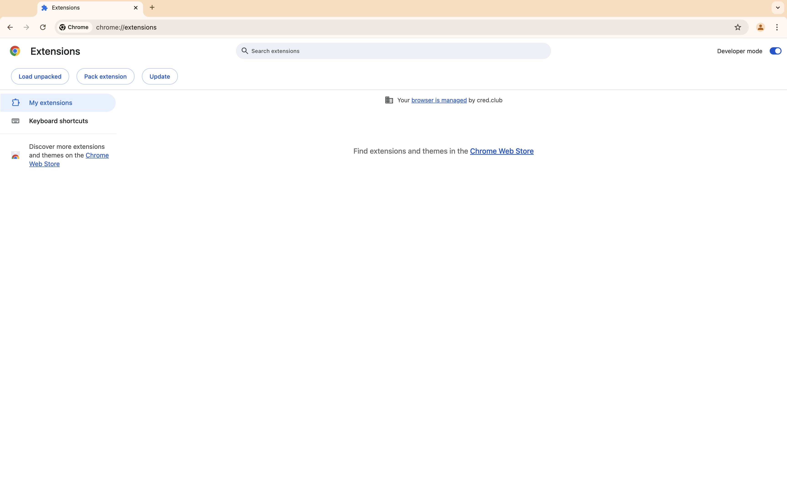
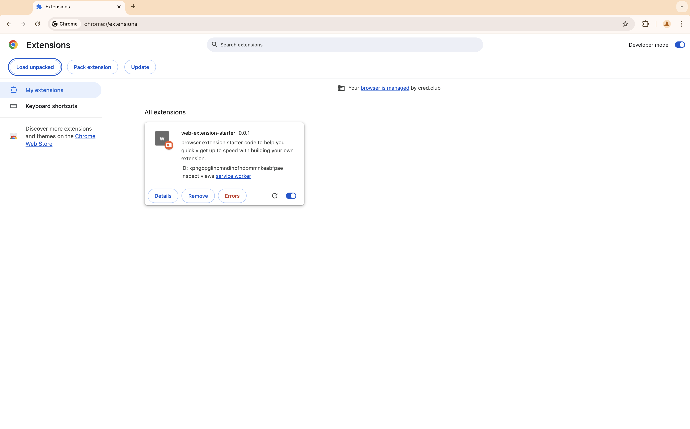

### web-extension-starter

react + typescript browser extension starter kit to help you quickly get up to speed with building your own extension.

### usage

1. clone the repo and run `npm i` and `npm run dev`.

2. go to `chrome://extensions` or click on `Manage Extensions` via your chrome browser toolbar and enable developer mode from the top right side.

3. click on `load unpacked` and select the build you generated in step 1.

4. you will be able to see web-extension-starter extension loaded in your browser.

### UI options

refer the video below to explore different UI options available in an extension. you can choose basis your use case.

### todo

1. analyze and optimize bundle size.

2. add hot reload capability to the extension.